# fractalRegression

An R package that includes fractal analysis functions for univariate Detrended Fluctuation Analysis and Multi-Fractal Detrended Fluctuation Analysis as well as bivariate Detrended Cross-Correlation Analysis and Multiscale Regression Analysis.
It is built on a C++ architecture and is thus, efficient for long time series. 

# Installation


The fractalRegression package will soon be available on CRAN (the
Comprehensive R Archive Network) and can then be installed using :
<https://cran.r-project.org/package=fractalRegression>

``` r
install.packages("fractalRegression")
```


The development version is available on Aaron Likens’ Github
(<https://github.com/aaronlikens/fractalRegression>) and can be
installed using R devtools. This is a source package and requires
compilation of C++ code. Windows users can install RTools software
package to get necessary components:
<https://cran.r-project.org/bin/windows/Rtools/>

``` r
devtools::install_github("aaronlikens/fractalRegression")
```


# Citation

If you use this package, please use the following citation.

```
 @Software{fractalRegression,
    title = {fractalRegression: An R package for univariate and bivariate fractal analyses},
    author = {Aaron D. Likens and Travis J. Wiltshire},
    year = {2021},
    url = {github.com/aaronlikens/fractalRegression},
  }
 ```

## Introduction

The aim with this `fractalRegression` package, and the subsequent
vignettes, is to show users how to use the various functions in the
package to perform univariate mono- and multi- fractal analysis as well
a bivariate fractal correlation and regression analyses.

## Detrended Fluctuation Analysis (DFA)

In this first example, we apply DFA, originally developed by Peng et
al. (1994) to simulated white noise, pink noise, and anti-correlated
noise using the `dfa()` function.

### White Noise Example

``` r
# Generate white noise
set.seed(23422345)
noise <- rnorm(5000)

# Run DFA on white noise
dfa.noise.out <- dfa(x = noise, order = 1, verbose = 1, sc_min = 16, sc_max = length(noise)/4, scale_ratio = 2)
```

Since we simulated this white noise, we would expect that our *α* is
close to 0.5. Indeed, we observe the estimate from the above analysis is
0.5207799. Next we use the `fgn_sim()` to simulate fractional Gaussian
noise with known properties.

### Pink Noise Example

``` r
# Generate pink noise
set.seed(34534534)
pink.noise <- fgn_sim(n = 5000, H = 0.9)

# Run DFA on pink noise
dfa.pink.out <- dfa(x = pink.noise, order = 1, verbose = 1, sc_min = 16, sc_max = length(pink.noise)/4, scale_ratio = 2)
```

Since we simulated this data with an H = 0.9, we would expect that our
*α* is close to this value. Again, we observe the estimate from the
above analysis is 0.833253. Next, we use `fgn_sim()` to generate some
anti-correlated noise.

### Anti-Correlated Fractional Gaussian Noise Example

``` r
# Generate anti-correlated noise 
set.seed(24633453)
anticorr.noise <- fgn_sim(n = 5000, H = 0.25)

# Run DFA on anti-correlated noise 
dfa.anticorr.out <- dfa(x = anticorr.noise, order = 1, verbose = 1, sc_min = 16, sc_max = length(anticorr.noise)/4, scale_ratio = 2)
```

As with above, since we simulated with H = 0.25, we observed a close
estimate of the *α* exponent, which is 0.2301879.

Now let’s take a look at the log-log plots for the three types of noise.
Given the estimates above, we see that the slopes for white noise, pink
noise, and anti-correlated noise conform to our expectations.

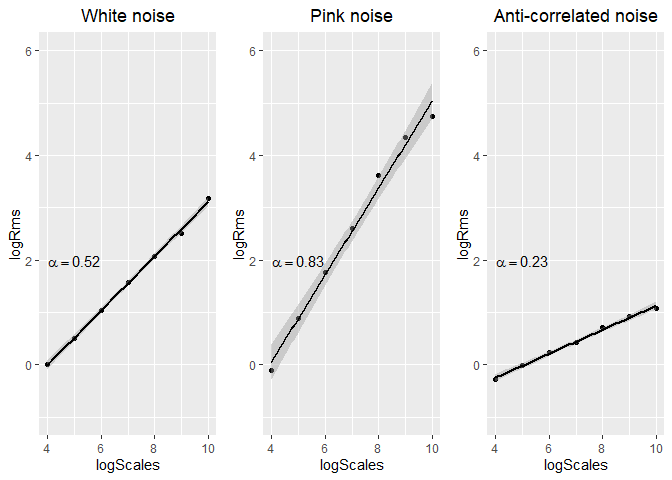

## Multifractal Detrended Fluctuation Analysis

Now that we have run a mono-fractal analysis using `dfa()`, we want to
expand this to look for evidence of multifractality using multifractal
detrended fluctuation analysis (MF-DFA) developed by Kantelhardt et
al. (2002). That is, we aim to determine whether there is evidence of
multiple scaling relationships and interactions across scales. We can do
this easily using the `mfdfa()` function.

``` r
# Run MF-DFA on simulated pink and white noise
mf.dfa.pink.out <- mfdfa(x = pink.noise, q = c(-5:5), order = 1, scale_min = 16, scale_max = length(pink.noise)/4, scale_ratio = 2)

mf.dfa.white.out <- mfdfa(x = noise, q = c(-5:5), order = 1, scale_min = 16, scale_max = length(noise)/4, scale_ratio = 2)
```

Let’s first make sure that our *α* estimate is the same as before when q
= 2. We can check this easily with the code below, and it looks good.
For example, the pink noise when q = 2, Hq = 0.833253, which is equal to
our *α* = 0.833253 from above.

``` r
mf.dfa.pink.out$Hq[mf.dfa.pink.out$q==2]
```

    ## [1] 0.833253

``` r
mf.dfa.white.out$Hq[mf.dfa.white.out$q==2]
```

    ## [1] 0.5207799

Next we are going to work with data that we include in our package
(`fractaldata`). This data was originally provided by Ihlen (2012). It
includes a white noise time series, monofractal time series, and a
multifractal time series.

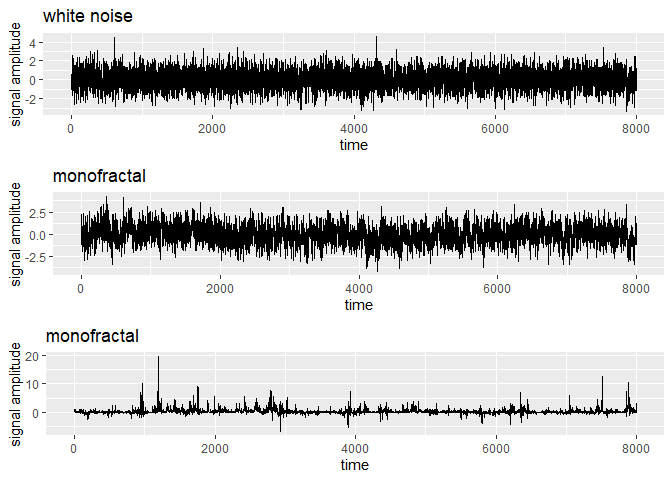

Now let’s run MFDFA on these times series. In this case we replicate the
choice of parameters in Ihlen (2012) with a q range of -5 to 5, and
order = 1, a scale min of 16, and a scale max 1,024.

``` r
white.mf.dfa.out <- mfdfa(x = fractaldata$whitenoise, q = c(-5:5), order = 1, scale_min = 16, scale_max = 1024, scale_ratio = 1.1)

mono.mf.dfa.out <- mfdfa(x = fractaldata$monofractal, q = c(-5:5), order = 1, scale_min = 16, scale_max = 1024, scale_ratio = 1.1)

multi.mf.dfa.out <- mfdfa(x = fractaldata$multifractal, q = c(-5:5), order = 1, scale_min = 16, scale_max = 1024, scale_ratio = 1.1)
```

A common way to understand if there is evidence of multifractality is to
examine a plot showing the Hq estimates for different values of q. If
all the plots have the same slope, that provides evidence of
monofractality. If there are distinct slopes, then there is evidence of
multifractality. It’s also important to check here that the slopes of
`log2scales` and `log2Fq` are linear, thus implying that they are scale
invariant. If not, then it could be the case that a higher order
polynomial detrending is appropriate (see Kantelhardt et al., 2001).

``` r
# Let's first make a plot of the monofractal case
monofractal.fluctuations <- as.data.frame(mono.mf.dfa.out$log2Fq)
graphics::matplot(monofractal.fluctuations, pch=19, add=FALSE, xlab="log Scale", ylab="log Fq", main = "Monofractal")
```

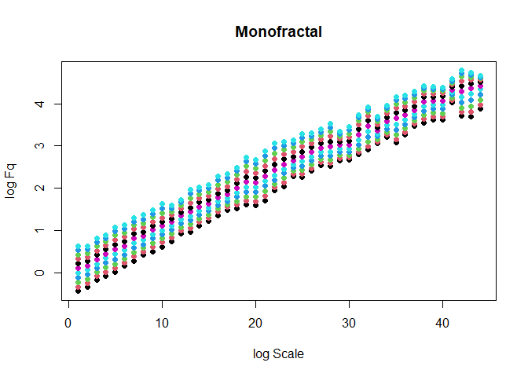

``` r

```

Now let’s compare the above plot for the monofractal and multifractal
results. We see that the slopes of the lines for the multifractal signal
are divergent.

``` r
multifractal.fluctuations <- as.data.frame(multi.mf.dfa.out$log2Fq)
graphics::matplot(multifractal.fluctuations, pch=19, add=FALSE, xlab="log Scale", ylab="log Fq", main = "Multifractal")
```

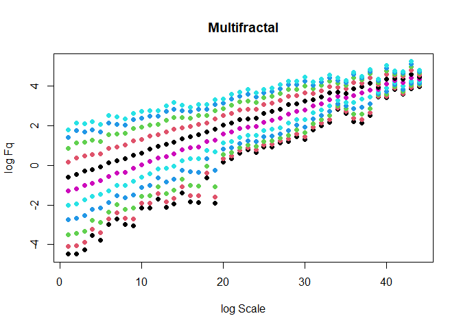

It’s also common to examine the relationship between Hq and q as well as
H and D(H).

``` r
# Let's start by plotting the Hq and q
plot(mono.mf.dfa.out$q,mono.mf.dfa.out$Hq, type= 'b', pch=19, ylim=c(0.4,2), ylab="Hq", xlab="q", main="q-order Hurst exponents for Mono- and Multi-fractal Signals")
lines(multi.mf.dfa.out$q,multi.mf.dfa.out$Hq, type='b', pch=19, col="blue")
legend(-4.5,2, legend = c("Monofractal", "Multifractal"), col=c("black", "blue"), lwd=1)
```

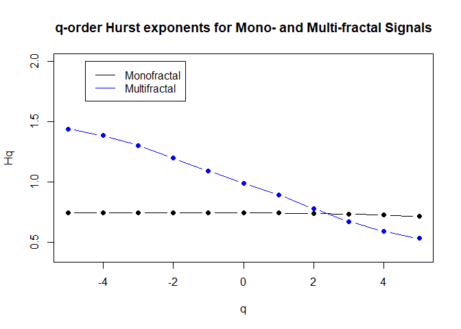

``` r
# Create the plot 
plot(mono.mf.dfa.out$h,mono.mf.dfa.out$Dh, type='b', lwd=1, lty=2, pch=19,ylim=c(-0.4,1),xlim=c(-.8,.8), ylab="D(h)", xlab="h", main= "Multifractal Spectrum for Mono- and Multi-fractal Signals")
lines(multi.mf.dfa.out$h,multi.mf.dfa.out$Dh, type='b', pch=19,lwd=3, col="blue")
legend(-.85,1, legend = c("Monofractal", "Multifractal"), col=c("black", "blue"), lwd=3)
```

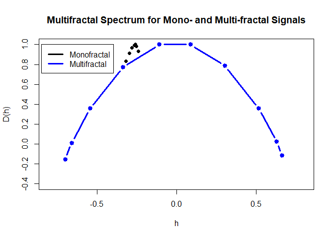

A common metric for comparing the multifractal spectrum is to calculate
the width (W) as the *h*<sub>*m**a**x*</sub> − *h*<sub>*m**i**n*</sub>.
Let’s do this to compare the monofractal and multifractal time series.
While from the figure above, it’s quite clear that the width of the
multifractal spectrum for the multifractal signal is larger, let’s
calculate it here anyways for the sake of completeness and because
spectrum width can be used as dependent variable in statistical
analyses.

``` r
mono.W <- max(mono.mf.dfa.out$h) - min(mono.mf.dfa.out$h)
multi.W <- max(multi.mf.dfa.out$h) - min(multi.mf.dfa.out$h)
```

We observe here that the W for the multifractal signal is 1.3629882 and
for the monofractal signal, W is 0.0758918.

## Detrended Cross-Correlation Analysis (DCCA)

Moving on from the univariate analyses, if we have two non-stationary
signals and we want to examine the scale-wise fluctuations as well as
the scale-wise cross-correlation of these fluctuations, we can use DCCA
using the `dcca()` function, which was originally developed originally
by Podobnik and Stanley (2008) and Zebende (2011).

### Simulate some data using a Mixed-correlated ARFIMA model (MC-ARFIMA).

First, however, we are going to simulate some data first. These
functions are taken from and available at Ladislav Kristoufek’s website
(<http://staff.utia.cas.cz/kristoufek/Ladislav_Kristoufek/Codes_files/MC-ARFIMA.R>)
and they correspond with the following paper (Kristoufek, 2013).

``` r
# Source the code directly

downloader::source_url("http://staff.utia.cas.cz/kristoufek/Ladislav_Kristoufek/Codes_files/MC-ARFIMA.R", prompt=FALSE, quiet = TRUE)
```

The MC-ARFIMA models take the form of the two equations shown below:


### Simulate some data with the MC-ARFIMA model

In this case, we use the parameters from Kristoufec (2013) for Model 1
(p. 6487) in which case the resulting two time series of length 10,000
exhibit long range correlations (LRC) as well as long range
cross-correlations (LRCC).

``` r
set.seed(987345757)
sim1 <- Mixed_ARFIMA_ARFIMA(alpha = 0.2, beta = 1, gamma = 1, delta = 0.2, n = 10000, d1 = 0.4, d2 = 0.3, d3 = 0.3, d4=0.4, rho=0.9)
plot(sim1[,1],type='l', ylab= "Signal Amplitude", xlab='Time', main = "MC-ARFIMA with LRC and LRCC")
lines(sim1[,2], col='blue')
```

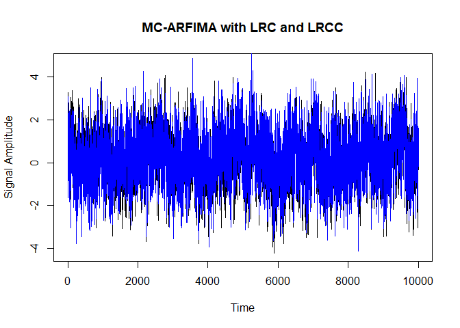

### Run DCCA on the MC-ARFIMA with LRC and LRCC

``` r
scales <- logScale(scale.min = 10, scale.max = 1000, scale.ratio = 1.1)
dcca.out.arfima <- dcca(sim1[,1], sim1[,2], order = 1, scales = scales)
dcca.out.arfima <- as.data.frame(dcca.out.arfima)
error <- sd(dcca.out.arfima$rho)/sqrt(length(dcca.out.arfima$rho))
dcca.plot <- ggplot(data=dcca.out.arfima, aes(x=scales,y=rho)) + geom_point() +geom_line() + ggtitle("DCCA on MC-ARFIMA processes with LRC and LRCC")+ geom_pointrange(aes(ymin=rho-error,ymax=rho+error))
#geom_smooth(method=lm, formula = y ~ poly(x, 2), se = TRUE)
dcca.plot
```

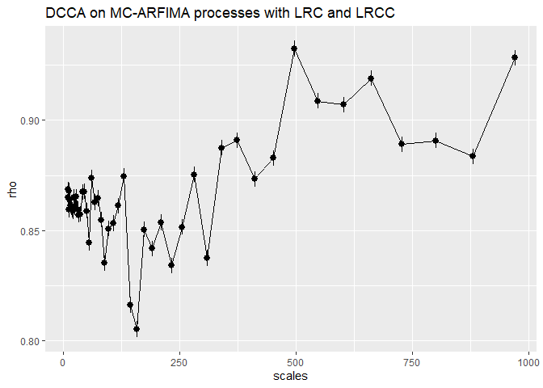

In the above figure, we see that the correlation between the MC-ARFIMA
processes are consistently high and continue to be high at increasing
time scales. Standard errors are plotted around each point. Now let’s
contrast this with MC-ARFIMA processes with LRC and short-range
cross-correlation (SRCC).

### Simulate MC-ARFIMA model with LRC and SRCC

``` r
set.seed(423422)
sim2 <- Mixed_ARFIMA_AR(alpha = 1,beta = 1,gamma = 1,delta = 1,n =10000,d1=0.4,d2=0.4,theta=0.8,rho=0.9)
plot(sim2[,1],type='l', ylab= "Signal Amplitude", xlab='Time', main = "MC-ARFIMA with LRC and SRCC")
lines(sim2[,2], col='blue')
```

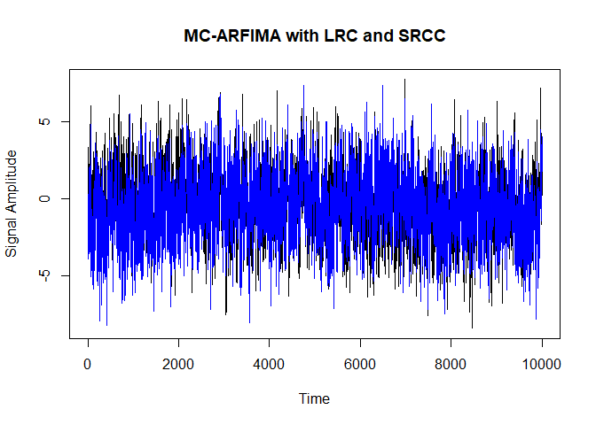

### Run DCCA on the MC-ARFIMA with LRC and SRCC

``` r
scales <- logScale(scale.min = 10, scale.max = 1000, scale.ratio = 1.1)
dcca.out.arfima2 <- dcca(sim2[,1], sim2[,2], order = 1, scales = scales)
dcca.out.arfima2 <- as.data.frame(dcca.out.arfima2)
error <- sd(dcca.out.arfima2$rho)/sqrt(length(dcca.out.arfima2$rho))
dcca.plot2 <- ggplot(data=dcca.out.arfima2, aes(x=scales,y=rho)) + geom_point() +geom_line() + ggtitle("DCCA on MC-ARFIMA processes with LRC and SRCC") + geom_pointrange(aes(ymin=rho-error,ymax=rho+error))
#geom_smooth(method=lm, formula = y ~ poly(x, 2), se = TRUE)
dcca.plot2
```

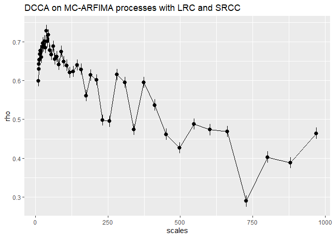

In contrast to the previous DCCA analysis, the above figure shows a
signal that begins with a high cross-correlation, but that begins to
deviate and trend lower substantially at increasing scale sizes.

## Multiscale Regression Analysis (MRA)

Let’s consider the above simulations, and consider the question: what if
we want to from a scale-wise correlation framework to a regression
framework? Or, put differently, can we use the scale-wise fluctuations
of one variable to predict the scale-wise fluctuations of the other? As
with a traditional regression approach, we will use one of our variables
as our predictor (*x*<sub>*t*</sub>) and the other as our outcome
(*y*<sub>*t*</sub>).

``` r
scales <- logScale(scale.min = 10, scale.max = 1000, scale.ratio = 1.1)
mra.out <- as.data.frame(mra(x = sim1[,1], y = sim1[,2],order = 1, scales = scales))
error <- sd(mra.out$betas)/sqrt(length(mra.out$betas))
mra.plot <- ggplot(data=mra.out, aes(x=scales,y=betas)) + geom_point() +geom_line() +ggtitle("Multiscale Regression Analysis for MC-ARFIMA with LRC and LRCC") + geom_pointrange(aes(ymin=betas-error,ymax=betas+error))
#geom_smooth(method=lm, formula = y ~ poly(x, 2), se = TRUE)
mra.plot
```

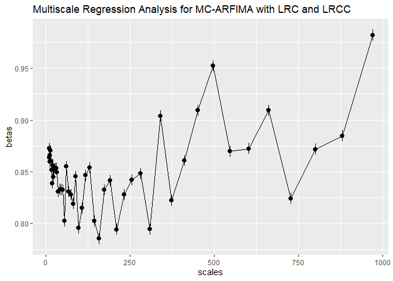

Generally, we observe that the *β* coefficients are relatively stable at
increasing time scales with a general, perhaps quadratically increasing
trend. Here it is also important to investigate the change in
*R*<sup>2</sup> as well as the *t*-values. Below we see that the
*R*<sup>2</sup> is quite high at most of the time scales with
*R*<sub>*m**i**n*</sub><sup>2</sup>= 0.65 and
*R*<sub>*m**a**x*</sub><sup>2</sup>= 0.87and all of the *t*-values
greater than the conventional cut-off at 1.96. So between these two
component ARFIMA processes, the output of MRA shows that much of the
scale specific variance in *y*<sub>*t*</sub> is explained and predicted
by *x*<sub>*t*</sub>.

``` r
knitr::kable(mra.out, format='html', digits =2,align='c',caption = "Output from MRA")
```

<table>
<caption>
Output from MRA
</caption>
<thead>
<tr>
<th style="text-align:center;">
scales
</th>
<th style="text-align:center;">
betas
</th>
<th style="text-align:center;">
r2
</th>
<th style="text-align:center;">
t_observed
</th>
</tr>
</thead>
<tbody>
<tr>
<td style="text-align:center;">
10
</td>
<td style="text-align:center;">
0.87
</td>
<td style="text-align:center;">
0.75
</td>
<td style="text-align:center;">
5.26
</td>
</tr>
<tr>
<td style="text-align:center;">
11
</td>
<td style="text-align:center;">
0.86
</td>
<td style="text-align:center;">
0.75
</td>
<td style="text-align:center;">
5.45
</td>
</tr>
<tr>
<td style="text-align:center;">
12
</td>
<td style="text-align:center;">
0.87
</td>
<td style="text-align:center;">
0.75
</td>
<td style="text-align:center;">
5.80
</td>
</tr>
<tr>
<td style="text-align:center;">
13
</td>
<td style="text-align:center;">
0.86
</td>
<td style="text-align:center;">
0.74
</td>
<td style="text-align:center;">
5.82
</td>
</tr>
<tr>
<td style="text-align:center;">
14
</td>
<td style="text-align:center;">
0.87
</td>
<td style="text-align:center;">
0.75
</td>
<td style="text-align:center;">
6.18
</td>
</tr>
<tr>
<td style="text-align:center;">
16
</td>
<td style="text-align:center;">
0.86
</td>
<td style="text-align:center;">
0.74
</td>
<td style="text-align:center;">
6.57
</td>
</tr>
<tr>
<td style="text-align:center;">
17
</td>
<td style="text-align:center;">
0.85
</td>
<td style="text-align:center;">
0.74
</td>
<td style="text-align:center;">
6.75
</td>
</tr>
<tr>
<td style="text-align:center;">
19
</td>
<td style="text-align:center;">
0.84
</td>
<td style="text-align:center;">
0.74
</td>
<td style="text-align:center;">
7.13
</td>
</tr>
<tr>
<td style="text-align:center;">
21
</td>
<td style="text-align:center;">
0.86
</td>
<td style="text-align:center;">
0.74
</td>
<td style="text-align:center;">
7.49
</td>
</tr>
<tr>
<td style="text-align:center;">
23
</td>
<td style="text-align:center;">
0.84
</td>
<td style="text-align:center;">
0.75
</td>
<td style="text-align:center;">
8.09
</td>
</tr>
<tr>
<td style="text-align:center;">
25
</td>
<td style="text-align:center;">
0.85
</td>
<td style="text-align:center;">
0.74
</td>
<td style="text-align:center;">
8.28
</td>
</tr>
<tr>
<td style="text-align:center;">
28
</td>
<td style="text-align:center;">
0.85
</td>
<td style="text-align:center;">
0.75
</td>
<td style="text-align:center;">
8.97
</td>
</tr>
<tr>
<td style="text-align:center;">
31
</td>
<td style="text-align:center;">
0.85
</td>
<td style="text-align:center;">
0.74
</td>
<td style="text-align:center;">
9.21
</td>
</tr>
<tr>
<td style="text-align:center;">
34
</td>
<td style="text-align:center;">
0.85
</td>
<td style="text-align:center;">
0.73
</td>
<td style="text-align:center;">
9.55
</td>
</tr>
<tr>
<td style="text-align:center;">
37
</td>
<td style="text-align:center;">
0.83
</td>
<td style="text-align:center;">
0.74
</td>
<td style="text-align:center;">
10.00
</td>
</tr>
<tr>
<td style="text-align:center;">
41
</td>
<td style="text-align:center;">
0.83
</td>
<td style="text-align:center;">
0.75
</td>
<td style="text-align:center;">
11.03
</td>
</tr>
<tr>
<td style="text-align:center;">
45
</td>
<td style="text-align:center;">
0.83
</td>
<td style="text-align:center;">
0.75
</td>
<td style="text-align:center;">
11.57
</td>
</tr>
<tr>
<td style="text-align:center;">
50
</td>
<td style="text-align:center;">
0.83
</td>
<td style="text-align:center;">
0.74
</td>
<td style="text-align:center;">
11.74
</td>
</tr>
<tr>
<td style="text-align:center;">
55
</td>
<td style="text-align:center;">
0.80
</td>
<td style="text-align:center;">
0.71
</td>
<td style="text-align:center;">
11.58
</td>
</tr>
<tr>
<td style="text-align:center;">
61
</td>
<td style="text-align:center;">
0.86
</td>
<td style="text-align:center;">
0.76
</td>
<td style="text-align:center;">
13.92
</td>
</tr>
<tr>
<td style="text-align:center;">
67
</td>
<td style="text-align:center;">
0.83
</td>
<td style="text-align:center;">
0.74
</td>
<td style="text-align:center;">
13.86
</td>
</tr>
<tr>
<td style="text-align:center;">
74
</td>
<td style="text-align:center;">
0.83
</td>
<td style="text-align:center;">
0.75
</td>
<td style="text-align:center;">
14.70
</td>
</tr>
<tr>
<td style="text-align:center;">
81
</td>
<td style="text-align:center;">
0.82
</td>
<td style="text-align:center;">
0.73
</td>
<td style="text-align:center;">
14.74
</td>
</tr>
<tr>
<td style="text-align:center;">
89
</td>
<td style="text-align:center;">
0.85
</td>
<td style="text-align:center;">
0.70
</td>
<td style="text-align:center;">
14.24
</td>
</tr>
<tr>
<td style="text-align:center;">
98
</td>
<td style="text-align:center;">
0.80
</td>
<td style="text-align:center;">
0.72
</td>
<td style="text-align:center;">
15.94
</td>
</tr>
<tr>
<td style="text-align:center;">
108
</td>
<td style="text-align:center;">
0.81
</td>
<td style="text-align:center;">
0.73
</td>
<td style="text-align:center;">
16.92
</td>
</tr>
<tr>
<td style="text-align:center;">
119
</td>
<td style="text-align:center;">
0.85
</td>
<td style="text-align:center;">
0.74
</td>
<td style="text-align:center;">
18.41
</td>
</tr>
<tr>
<td style="text-align:center;">
131
</td>
<td style="text-align:center;">
0.85
</td>
<td style="text-align:center;">
0.76
</td>
<td style="text-align:center;">
20.57
</td>
</tr>
<tr>
<td style="text-align:center;">
144
</td>
<td style="text-align:center;">
0.80
</td>
<td style="text-align:center;">
0.67
</td>
<td style="text-align:center;">
16.89
</td>
</tr>
<tr>
<td style="text-align:center;">
158
</td>
<td style="text-align:center;">
0.79
</td>
<td style="text-align:center;">
0.65
</td>
<td style="text-align:center;">
17.01
</td>
</tr>
<tr>
<td style="text-align:center;">
174
</td>
<td style="text-align:center;">
0.83
</td>
<td style="text-align:center;">
0.72
</td>
<td style="text-align:center;">
21.26
</td>
</tr>
<tr>
<td style="text-align:center;">
191
</td>
<td style="text-align:center;">
0.84
</td>
<td style="text-align:center;">
0.71
</td>
<td style="text-align:center;">
21.49
</td>
</tr>
<tr>
<td style="text-align:center;">
211
</td>
<td style="text-align:center;">
0.79
</td>
<td style="text-align:center;">
0.73
</td>
<td style="text-align:center;">
23.74
</td>
</tr>
<tr>
<td style="text-align:center;">
232
</td>
<td style="text-align:center;">
0.83
</td>
<td style="text-align:center;">
0.70
</td>
<td style="text-align:center;">
22.98
</td>
</tr>
<tr>
<td style="text-align:center;">
255
</td>
<td style="text-align:center;">
0.84
</td>
<td style="text-align:center;">
0.72
</td>
<td style="text-align:center;">
25.88
</td>
</tr>
<tr>
<td style="text-align:center;">
281
</td>
<td style="text-align:center;">
0.85
</td>
<td style="text-align:center;">
0.77
</td>
<td style="text-align:center;">
30.29
</td>
</tr>
<tr>
<td style="text-align:center;">
309
</td>
<td style="text-align:center;">
0.79
</td>
<td style="text-align:center;">
0.70
</td>
<td style="text-align:center;">
26.90
</td>
</tr>
<tr>
<td style="text-align:center;">
340
</td>
<td style="text-align:center;">
0.90
</td>
<td style="text-align:center;">
0.79
</td>
<td style="text-align:center;">
35.45
</td>
</tr>
<tr>
<td style="text-align:center;">
374
</td>
<td style="text-align:center;">
0.82
</td>
<td style="text-align:center;">
0.79
</td>
<td style="text-align:center;">
37.87
</td>
</tr>
<tr>
<td style="text-align:center;">
411
</td>
<td style="text-align:center;">
0.86
</td>
<td style="text-align:center;">
0.76
</td>
<td style="text-align:center;">
36.29
</td>
</tr>
<tr>
<td style="text-align:center;">
452
</td>
<td style="text-align:center;">
0.91
</td>
<td style="text-align:center;">
0.78
</td>
<td style="text-align:center;">
39.92
</td>
</tr>
<tr>
<td style="text-align:center;">
497
</td>
<td style="text-align:center;">
0.95
</td>
<td style="text-align:center;">
0.87
</td>
<td style="text-align:center;">
57.44
</td>
</tr>
<tr>
<td style="text-align:center;">
547
</td>
<td style="text-align:center;">
0.87
</td>
<td style="text-align:center;">
0.83
</td>
<td style="text-align:center;">
50.85
</td>
</tr>
<tr>
<td style="text-align:center;">
602
</td>
<td style="text-align:center;">
0.87
</td>
<td style="text-align:center;">
0.82
</td>
<td style="text-align:center;">
52.81
</td>
</tr>
<tr>
<td style="text-align:center;">
662
</td>
<td style="text-align:center;">
0.91
</td>
<td style="text-align:center;">
0.84
</td>
<td style="text-align:center;">
59.92
</td>
</tr>
<tr>
<td style="text-align:center;">
728
</td>
<td style="text-align:center;">
0.82
</td>
<td style="text-align:center;">
0.79
</td>
<td style="text-align:center;">
52.33
</td>
</tr>
<tr>
<td style="text-align:center;">
801
</td>
<td style="text-align:center;">
0.87
</td>
<td style="text-align:center;">
0.79
</td>
<td style="text-align:center;">
55.44
</td>
</tr>
<tr>
<td style="text-align:center;">
881
</td>
<td style="text-align:center;">
0.88
</td>
<td style="text-align:center;">
0.78
</td>
<td style="text-align:center;">
55.96
</td>
</tr>
<tr>
<td style="text-align:center;">
970
</td>
<td style="text-align:center;">
0.98
</td>
<td style="text-align:center;">
0.86
</td>
<td style="text-align:center;">
77.65
</td>
</tr>
</tbody>
</table>

## Multiscale Lagged Regression Analysis (MLRA)

Building on MRA, we can add in lagged relationships to the analysis
using `mlra()` and see not only whether there are scale-wise variations
in the *β* coefficients, but changes in these at particular time lags.

``` r
scales <- logScale(scale.min = 10, scale.max = 1000, scale.ratio = 1.1)
mlra.out <- mlra(x = sim1[,1], y = sim1[,2],order = 1, scales = scales, lags=100, direction='p')
colfunc <- colorRampPalette(c("green", "red"))
graphics::matplot(mlra.out$betas, type='l', col = colfunc(49), ylab="Beta Coefficient", xlab='Lag', main="Multiscale Lagged Regression Analysis")
```

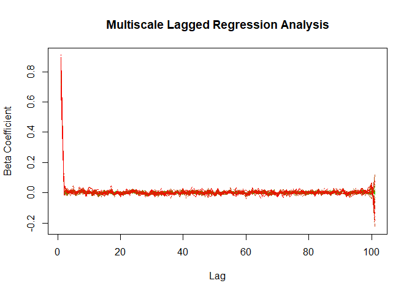

The figure above shows that there is high *β* values across scales only
for lags near to 0. But, it’s difficult to see the scale-wise variation
in this type of plot. Another option is to use `image()` or
`image.plot()` to visualize the results of the `mlra()` function. This
plot more clearly shows a color gradient corresponding to the strength
of the /*b**e**t**a* coefficient across scales on the y-axis and at
increasing lags (x-axis).

``` r
x <- 0:100
y <- scales
image.plot(x, y, mlra.out$betas, axes=TRUE, legend.lab = "Beta Coefficient", ylab="Scale", xlab="Lag", main="Multiscale Lagged Regression Analysis")
```

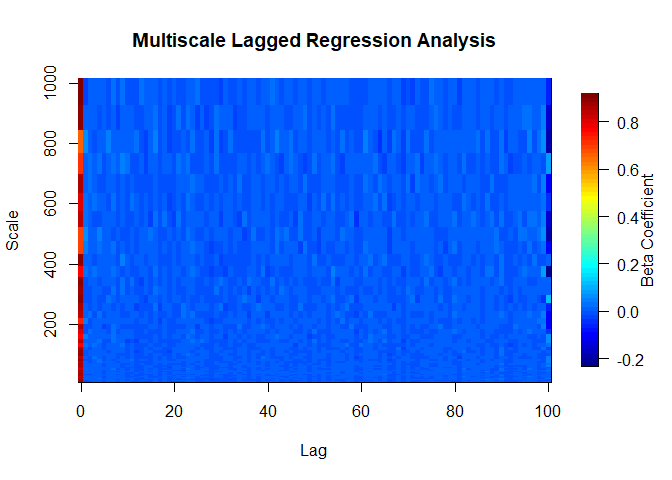

Depending on the data, it could also be nice to add contours to the plot, but it doesn't make much sense here. Regardless, some code below shows how this could be done.  
``` r
#contour(x, y, mlra.out$betas,levels=seq(0,1,by=1),add=TRUE,col='black')
```

# An Empirical Example

So far we’ve demonstrated analyses on simulated data. Next we are going
to analyze a pair of empirical handmovement time series from a dyad that
are included in the `crqa` package and discussed in detail in Wallot et
al. (2016). These data are hand-movement velocity profiles.

### Load data from the crqa package and visualize it

``` r
require(crqa)
data(crqa)
head(handmovement)
```

    ##      P1_TT_d    P1_TT_n     P2_TT_d     P2_TT_n
    ## 1 0.22702423 0.26757616 0.006000000 0.000000000
    ## 2 0.47086091 0.23433310 0.008366600 0.006708204
    ## 3 0.14652304 0.16225289 0.006708204 0.006000000
    ## 4 0.40472830 0.02319483 0.009055385 0.010392305
    ## 5 0.07187489 0.04341659 0.007348469 0.006708204
    ## 6 0.10543719 0.06870953 0.005196152 0.007348469

``` r
plot(handmovement$P1_TT_d, type='l', main = " Dominant hand-movement velocity profiles of two participants", xlab='time',ylab='movement velocity')
lines(handmovement$P2_TT_d, col=2)
```

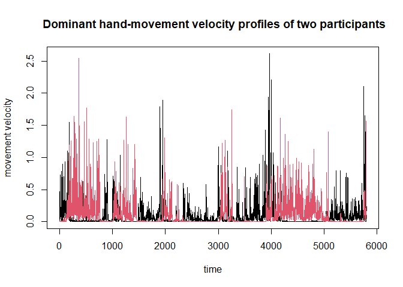

## MF-DFA on Empirical Data

Using the dominant hand variable for participant 1 `P1_tt_d` and for
participant two `P1_tt_d`, we are going to look at the fractal dynamics
first. We are going to run `mfdfa()` and look at the q=2 (monofractal)
scaling as well as multifractal scaling.

``` r
# Participant 1
q <- seq(0,5, by=0.25)
mf.dfa.P1hand.out <- mfdfa(x = handmovement$P1_TT_d, q = q, order = 1, scale_min = 16, scale_max = length(handmovement$P1_TT_d)/4, scale_ratio = 2)

# Participant 2
mf.dfa.P2hand.out <- mfdfa(x = handmovement$P2_TT_d, q = q, order = 1, scale_min = 16, scale_max = length(handmovement$P2_TT_d)/4, scale_ratio = 2)

# Examine the alpha exponent for q=2, which is equivalent to running DFA
mf.dfa.P1hand.out$Hq[mf.dfa.P1hand.out$q==2]
```

    ## [1] 0.8788367

``` r
mf.dfa.P2hand.out$Hq[mf.dfa.P2hand.out$q==2]
```

    ## [1] 0.9174263

For Participant 1, we observe a value of 0.88 and for Participant 2 a
value of 0.92, which suggests both exhibit long-range correlations and
the signals approximate pink noise. Next, want to examine the
multi-fractal spectra.

``` r
# Create the plot 
plot(mf.dfa.P1hand.out$h,mf.dfa.P1hand.out$Dh, type='b', lwd=1, lty=2, pch=19,ylim=c(-0.4,1),xlim=c(-.8,.8), ylab="D(h)", xlab="h", main= "Multifractal Spectrum for Dominant Hand Movements")
lines(mf.dfa.P2hand.out$h,mf.dfa.P2hand.out$Dh, type='b', pch=19,lwd=3, col="blue")
legend(-.85,1, legend = c("P1", "P2"), col=c("black", "blue"), lwd=3)
```

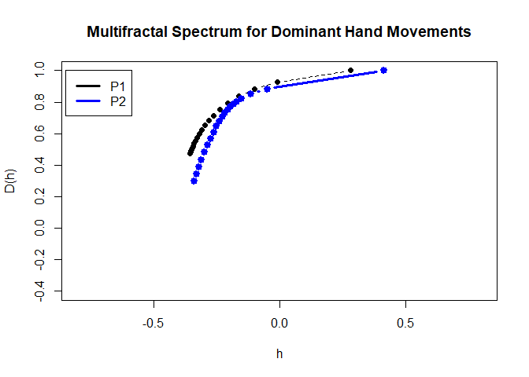

``` r
P1.W <- max(mf.dfa.P1hand.out$h) - min(mf.dfa.P1hand.out$h)
P2.W <- max(mf.dfa.P2hand.out$h) - min(mf.dfa.P2hand.out$h)
```

When comparing multi-fractal spectrum width (W),
*h*<sub>*m**a**x*</sub> − *h*<sub>*m**i**n*</sub>, we observe that both
signals have a similar W. Specifically, Participant 1 W = 0.64 and
Participant 2 W = 0.76. From the figures and W estimates, there does
appear to be scale-wise variation in the scaling exponents. However, a
surrogate test could make this inference more robust.

## DCCA on Empirical Data

Next, we are going to work with these hand movement time series from a
dyad and try to examine the scale-wise cross-correlation between the
time series. But first, let’s see if they are cross-correlated in
general.

``` r
ccf(handmovement$P1_TT_d, handmovement$P2_TT_d, lag.max = 500, main = "Cross-correlation function of P1 and P2 Hand Movements")
```

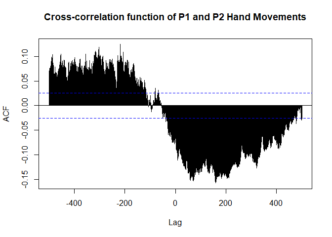

It appears that there might be some lagged relationship between the two
signals. Now, we can run and examine the results of `dcca()` examining
the scale-wise detrended cross-correlation coefficients.

``` r
# Set scales 
scales <- seq(15, 1000, by = 5)
# Note that a small amount of noise was added to these time series to avoid processor specific issues.
# This is not a necessary step for typical analyses
p1 = handmovement$P1_TT_d + rnorm(1, 0,.001)
p2 = handmovement$P2_TT_d + rnorm(1, 0,.001)
dcca.out = dcca(x = p1, y = p2, order = 1, scales = scales)
dcca.out <- as.data.frame(dcca.out)
# dcca.plot <- ggplot(data=dcca.out, aes(x=scales,y=rho)) + geom_point() +geom_line()
plot(dcca.out$scales, dcca.out$rho, type = 'b', pch = 16, xlab = 'Scale',
     ylab = expression(rho))
```

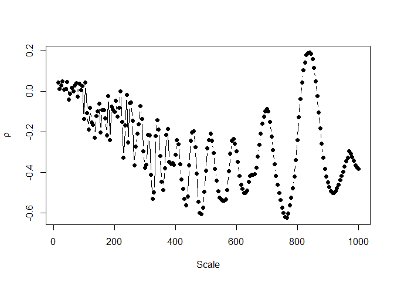

``` r
# dcca.plot
```

At smaller scales, *ρ* approximates zero. However, at increasing scale
sizes the trend of the *ρ* estimates become negative exhibit quite large
fluctuations.

## MRA on Empirical Data

Building on the above DCCA results, we use `mra()` to determine if can
we use the the scale-wise fluctuations in Particiapnt 2’s hand movements
to predict those in Participant 1.

``` r
scales <- seq(15, 1000, by = 5)
p1 = handmovement$P1_TT_d + rnorm(1, 0, .001)
p2 = handmovement$P2_TT_d + rnorm(1, 0, .001)
mra.out <- as.data.frame(mra(x = p1, y = p2, order = 2, scales = scales))
mra.plot <- ggplot(data=mra.out, aes(x=scales,y=betas)) + geom_point() +geom_line()
mra.plot
```


In the table below, we filter out those *β* coefficients, whose
corresponding t-values are greater than +/- 1.96 to provide an index of
how many scales there are where Participant 2’s hand movements are
significant predictors for Participant 1’s hand movements.

``` r
mra.out.sig <- subset(mra.out, abs(mra.out$t_observed) > 1.96)
knitr::kable(mra.out.sig, format='html', digits =2,align='c',caption = "Output from MRA on Handmovement Data")
```

<table>
<caption>
Output from MRA on Handmovement Data
</caption>
<thead>
<tr>
<th style="text-align:left;">
</th>
<th style="text-align:center;">
scales
</th>
<th style="text-align:center;">
betas
</th>
<th style="text-align:center;">
r2
</th>
<th style="text-align:center;">
t_observed
</th>
</tr>
</thead>
<tbody>
<tr>
<td style="text-align:left;">
44
</td>
<td style="text-align:center;">
230
</td>
<td style="text-align:center;">
-0.17
</td>
<td style="text-align:center;">
0.02
</td>
<td style="text-align:center;">
-2.35
</td>
</tr>
<tr>
<td style="text-align:left;">
48
</td>
<td style="text-align:center;">
250
</td>
<td style="text-align:center;">
-0.20
</td>
<td style="text-align:center;">
0.05
</td>
<td style="text-align:center;">
-3.52
</td>
</tr>
<tr>
<td style="text-align:left;">
50
</td>
<td style="text-align:center;">
260
</td>
<td style="text-align:center;">
-0.15
</td>
<td style="text-align:center;">
0.03
</td>
<td style="text-align:center;">
-2.77
</td>
</tr>
<tr>
<td style="text-align:left;">
52
</td>
<td style="text-align:center;">
270
</td>
<td style="text-align:center;">
-0.21
</td>
<td style="text-align:center;">
0.04
</td>
<td style="text-align:center;">
-3.25
</td>
</tr>
<tr>
<td style="text-align:left;">
57
</td>
<td style="text-align:center;">
295
</td>
<td style="text-align:center;">
-0.14
</td>
<td style="text-align:center;">
0.02
</td>
<td style="text-align:center;">
-2.56
</td>
</tr>
<tr>
<td style="text-align:left;">
61
</td>
<td style="text-align:center;">
315
</td>
<td style="text-align:center;">
-0.15
</td>
<td style="text-align:center;">
0.03
</td>
<td style="text-align:center;">
-2.94
</td>
</tr>
<tr>
<td style="text-align:left;">
63
</td>
<td style="text-align:center;">
325
</td>
<td style="text-align:center;">
-0.15
</td>
<td style="text-align:center;">
0.02
</td>
<td style="text-align:center;">
-2.69
</td>
</tr>
<tr>
<td style="text-align:left;">
64
</td>
<td style="text-align:center;">
330
</td>
<td style="text-align:center;">
-0.16
</td>
<td style="text-align:center;">
0.03
</td>
<td style="text-align:center;">
-3.09
</td>
</tr>
<tr>
<td style="text-align:left;">
65
</td>
<td style="text-align:center;">
335
</td>
<td style="text-align:center;">
-0.14
</td>
<td style="text-align:center;">
0.02
</td>
<td style="text-align:center;">
-2.92
</td>
</tr>
<tr>
<td style="text-align:left;">
66
</td>
<td style="text-align:center;">
340
</td>
<td style="text-align:center;">
-0.09
</td>
<td style="text-align:center;">
0.01
</td>
<td style="text-align:center;">
-2.09
</td>
</tr>
<tr>
<td style="text-align:left;">
67
</td>
<td style="text-align:center;">
345
</td>
<td style="text-align:center;">
-0.09
</td>
<td style="text-align:center;">
0.01
</td>
<td style="text-align:center;">
-1.99
</td>
</tr>
<tr>
<td style="text-align:left;">
68
</td>
<td style="text-align:center;">
350
</td>
<td style="text-align:center;">
-0.18
</td>
<td style="text-align:center;">
0.06
</td>
<td style="text-align:center;">
-4.63
</td>
</tr>
<tr>
<td style="text-align:left;">
69
</td>
<td style="text-align:center;">
355
</td>
<td style="text-align:center;">
-0.15
</td>
<td style="text-align:center;">
0.03
</td>
<td style="text-align:center;">
-3.47
</td>
</tr>
<tr>
<td style="text-align:left;">
72
</td>
<td style="text-align:center;">
370
</td>
<td style="text-align:center;">
-0.25
</td>
<td style="text-align:center;">
0.05
</td>
<td style="text-align:center;">
-4.46
</td>
</tr>
<tr>
<td style="text-align:left;">
82
</td>
<td style="text-align:center;">
420
</td>
<td style="text-align:center;">
-0.09
</td>
<td style="text-align:center;">
0.01
</td>
<td style="text-align:center;">
-2.17
</td>
</tr>
<tr>
<td style="text-align:left;">
83
</td>
<td style="text-align:center;">
425
</td>
<td style="text-align:center;">
-0.15
</td>
<td style="text-align:center;">
0.03
</td>
<td style="text-align:center;">
-3.64
</td>
</tr>
<tr>
<td style="text-align:left;">
88
</td>
<td style="text-align:center;">
450
</td>
<td style="text-align:center;">
-0.12
</td>
<td style="text-align:center;">
0.01
</td>
<td style="text-align:center;">
-2.18
</td>
</tr>
<tr>
<td style="text-align:left;">
89
</td>
<td style="text-align:center;">
455
</td>
<td style="text-align:center;">
-0.25
</td>
<td style="text-align:center;">
0.05
</td>
<td style="text-align:center;">
-4.63
</td>
</tr>
<tr>
<td style="text-align:left;">
90
</td>
<td style="text-align:center;">
460
</td>
<td style="text-align:center;">
-0.23
</td>
<td style="text-align:center;">
0.05
</td>
<td style="text-align:center;">
-4.86
</td>
</tr>
<tr>
<td style="text-align:left;">
91
</td>
<td style="text-align:center;">
465
</td>
<td style="text-align:center;">
-0.16
</td>
<td style="text-align:center;">
0.03
</td>
<td style="text-align:center;">
-4.09
</td>
</tr>
<tr>
<td style="text-align:left;">
92
</td>
<td style="text-align:center;">
470
</td>
<td style="text-align:center;">
-0.11
</td>
<td style="text-align:center;">
0.02
</td>
<td style="text-align:center;">
-2.97
</td>
</tr>
<tr>
<td style="text-align:left;">
93
</td>
<td style="text-align:center;">
475
</td>
<td style="text-align:center;">
-0.09
</td>
<td style="text-align:center;">
0.01
</td>
<td style="text-align:center;">
-2.17
</td>
</tr>
<tr>
<td style="text-align:left;">
94
</td>
<td style="text-align:center;">
480
</td>
<td style="text-align:center;">
-0.14
</td>
<td style="text-align:center;">
0.02
</td>
<td style="text-align:center;">
-2.86
</td>
</tr>
<tr>
<td style="text-align:left;">
95
</td>
<td style="text-align:center;">
485
</td>
<td style="text-align:center;">
-0.32
</td>
<td style="text-align:center;">
0.07
</td>
<td style="text-align:center;">
-5.82
</td>
</tr>
<tr>
<td style="text-align:left;">
96
</td>
<td style="text-align:center;">
490
</td>
<td style="text-align:center;">
-0.41
</td>
<td style="text-align:center;">
0.12
</td>
<td style="text-align:center;">
-8.36
</td>
</tr>
<tr>
<td style="text-align:left;">
97
</td>
<td style="text-align:center;">
495
</td>
<td style="text-align:center;">
-0.38
</td>
<td style="text-align:center;">
0.13
</td>
<td style="text-align:center;">
-8.43
</td>
</tr>
<tr>
<td style="text-align:left;">
98
</td>
<td style="text-align:center;">
500
</td>
<td style="text-align:center;">
-0.26
</td>
<td style="text-align:center;">
0.06
</td>
<td style="text-align:center;">
-5.50
</td>
</tr>
<tr>
<td style="text-align:left;">
99
</td>
<td style="text-align:center;">
505
</td>
<td style="text-align:center;">
-0.14
</td>
<td style="text-align:center;">
0.02
</td>
<td style="text-align:center;">
-2.91
</td>
</tr>
<tr>
<td style="text-align:left;">
100
</td>
<td style="text-align:center;">
510
</td>
<td style="text-align:center;">
-0.14
</td>
<td style="text-align:center;">
0.02
</td>
<td style="text-align:center;">
-2.95
</td>
</tr>
<tr>
<td style="text-align:left;">
101
</td>
<td style="text-align:center;">
515
</td>
<td style="text-align:center;">
-0.14
</td>
<td style="text-align:center;">
0.02
</td>
<td style="text-align:center;">
-3.07
</td>
</tr>
<tr>
<td style="text-align:left;">
102
</td>
<td style="text-align:center;">
520
</td>
<td style="text-align:center;">
-0.15
</td>
<td style="text-align:center;">
0.03
</td>
<td style="text-align:center;">
-3.69
</td>
</tr>
<tr>
<td style="text-align:left;">
103
</td>
<td style="text-align:center;">
525
</td>
<td style="text-align:center;">
-0.19
</td>
<td style="text-align:center;">
0.05
</td>
<td style="text-align:center;">
-5.11
</td>
</tr>
<tr>
<td style="text-align:left;">
104
</td>
<td style="text-align:center;">
530
</td>
<td style="text-align:center;">
-0.25
</td>
<td style="text-align:center;">
0.08
</td>
<td style="text-align:center;">
-6.96
</td>
</tr>
<tr>
<td style="text-align:left;">
105
</td>
<td style="text-align:center;">
535
</td>
<td style="text-align:center;">
-0.29
</td>
<td style="text-align:center;">
0.11
</td>
<td style="text-align:center;">
-8.23
</td>
</tr>
<tr>
<td style="text-align:left;">
106
</td>
<td style="text-align:center;">
540
</td>
<td style="text-align:center;">
-0.31
</td>
<td style="text-align:center;">
0.12
</td>
<td style="text-align:center;">
-8.47
</td>
</tr>
<tr>
<td style="text-align:left;">
107
</td>
<td style="text-align:center;">
545
</td>
<td style="text-align:center;">
-0.36
</td>
<td style="text-align:center;">
0.13
</td>
<td style="text-align:center;">
-8.83
</td>
</tr>
<tr>
<td style="text-align:left;">
108
</td>
<td style="text-align:center;">
550
</td>
<td style="text-align:center;">
-0.34
</td>
<td style="text-align:center;">
0.10
</td>
<td style="text-align:center;">
-7.98
</td>
</tr>
<tr>
<td style="text-align:left;">
109
</td>
<td style="text-align:center;">
555
</td>
<td style="text-align:center;">
-0.30
</td>
<td style="text-align:center;">
0.07
</td>
<td style="text-align:center;">
-6.55
</td>
</tr>
<tr>
<td style="text-align:left;">
110
</td>
<td style="text-align:center;">
560
</td>
<td style="text-align:center;">
-0.28
</td>
<td style="text-align:center;">
0.06
</td>
<td style="text-align:center;">
-5.76
</td>
</tr>
<tr>
<td style="text-align:left;">
111
</td>
<td style="text-align:center;">
565
</td>
<td style="text-align:center;">
-0.32
</td>
<td style="text-align:center;">
0.06
</td>
<td style="text-align:center;">
-5.95
</td>
</tr>
<tr>
<td style="text-align:left;">
112
</td>
<td style="text-align:center;">
570
</td>
<td style="text-align:center;">
-0.34
</td>
<td style="text-align:center;">
0.06
</td>
<td style="text-align:center;">
-6.18
</td>
</tr>
<tr>
<td style="text-align:left;">
113
</td>
<td style="text-align:center;">
575
</td>
<td style="text-align:center;">
-0.37
</td>
<td style="text-align:center;">
0.07
</td>
<td style="text-align:center;">
-6.67
</td>
</tr>
<tr>
<td style="text-align:left;">
114
</td>
<td style="text-align:center;">
580
</td>
<td style="text-align:center;">
-0.47
</td>
<td style="text-align:center;">
0.11
</td>
<td style="text-align:center;">
-8.41
</td>
</tr>
<tr>
<td style="text-align:left;">
115
</td>
<td style="text-align:center;">
585
</td>
<td style="text-align:center;">
-0.58
</td>
<td style="text-align:center;">
0.17
</td>
<td style="text-align:center;">
-10.79
</td>
</tr>
<tr>
<td style="text-align:left;">
116
</td>
<td style="text-align:center;">
590
</td>
<td style="text-align:center;">
-0.60
</td>
<td style="text-align:center;">
0.20
</td>
<td style="text-align:center;">
-12.04
</td>
</tr>
<tr>
<td style="text-align:left;">
117
</td>
<td style="text-align:center;">
595
</td>
<td style="text-align:center;">
-0.54
</td>
<td style="text-align:center;">
0.19
</td>
<td style="text-align:center;">
-11.90
</td>
</tr>
<tr>
<td style="text-align:left;">
118
</td>
<td style="text-align:center;">
600
</td>
<td style="text-align:center;">
-0.52
</td>
<td style="text-align:center;">
0.21
</td>
<td style="text-align:center;">
-12.45
</td>
</tr>
<tr>
<td style="text-align:left;">
119
</td>
<td style="text-align:center;">
605
</td>
<td style="text-align:center;">
-0.46
</td>
<td style="text-align:center;">
0.18
</td>
<td style="text-align:center;">
-11.66
</td>
</tr>
<tr>
<td style="text-align:left;">
120
</td>
<td style="text-align:center;">
610
</td>
<td style="text-align:center;">
-0.43
</td>
<td style="text-align:center;">
0.18
</td>
<td style="text-align:center;">
-11.51
</td>
</tr>
<tr>
<td style="text-align:left;">
121
</td>
<td style="text-align:center;">
615
</td>
<td style="text-align:center;">
-0.37
</td>
<td style="text-align:center;">
0.15
</td>
<td style="text-align:center;">
-10.54
</td>
</tr>
<tr>
<td style="text-align:left;">
122
</td>
<td style="text-align:center;">
620
</td>
<td style="text-align:center;">
-0.32
</td>
<td style="text-align:center;">
0.11
</td>
<td style="text-align:center;">
-8.97
</td>
</tr>
<tr>
<td style="text-align:left;">
123
</td>
<td style="text-align:center;">
625
</td>
<td style="text-align:center;">
-0.33
</td>
<td style="text-align:center;">
0.11
</td>
<td style="text-align:center;">
-8.63
</td>
</tr>
<tr>
<td style="text-align:left;">
124
</td>
<td style="text-align:center;">
630
</td>
<td style="text-align:center;">
-0.40
</td>
<td style="text-align:center;">
0.12
</td>
<td style="text-align:center;">
-9.32
</td>
</tr>
<tr>
<td style="text-align:left;">
125
</td>
<td style="text-align:center;">
635
</td>
<td style="text-align:center;">
-0.55
</td>
<td style="text-align:center;">
0.18
</td>
<td style="text-align:center;">
-11.84
</td>
</tr>
<tr>
<td style="text-align:left;">
126
</td>
<td style="text-align:center;">
640
</td>
<td style="text-align:center;">
-0.63
</td>
<td style="text-align:center;">
0.22
</td>
<td style="text-align:center;">
-13.51
</td>
</tr>
<tr>
<td style="text-align:left;">
127
</td>
<td style="text-align:center;">
645
</td>
<td style="text-align:center;">
-0.69
</td>
<td style="text-align:center;">
0.26
</td>
<td style="text-align:center;">
-15.23
</td>
</tr>
<tr>
<td style="text-align:left;">
128
</td>
<td style="text-align:center;">
650
</td>
<td style="text-align:center;">
-0.68
</td>
<td style="text-align:center;">
0.27
</td>
<td style="text-align:center;">
-15.59
</td>
</tr>
<tr>
<td style="text-align:left;">
129
</td>
<td style="text-align:center;">
655
</td>
<td style="text-align:center;">
-0.62
</td>
<td style="text-align:center;">
0.25
</td>
<td style="text-align:center;">
-14.69
</td>
</tr>
<tr>
<td style="text-align:left;">
130
</td>
<td style="text-align:center;">
660
</td>
<td style="text-align:center;">
-0.55
</td>
<td style="text-align:center;">
0.20
</td>
<td style="text-align:center;">
-13.00
</td>
</tr>
<tr>
<td style="text-align:left;">
131
</td>
<td style="text-align:center;">
665
</td>
<td style="text-align:center;">
-0.44
</td>
<td style="text-align:center;">
0.13
</td>
<td style="text-align:center;">
-9.75
</td>
</tr>
<tr>
<td style="text-align:left;">
132
</td>
<td style="text-align:center;">
670
</td>
<td style="text-align:center;">
-0.31
</td>
<td style="text-align:center;">
0.06
</td>
<td style="text-align:center;">
-6.45
</td>
</tr>
<tr>
<td style="text-align:left;">
133
</td>
<td style="text-align:center;">
675
</td>
<td style="text-align:center;">
-0.23
</td>
<td style="text-align:center;">
0.03
</td>
<td style="text-align:center;">
-4.47
</td>
</tr>
<tr>
<td style="text-align:left;">
134
</td>
<td style="text-align:center;">
680
</td>
<td style="text-align:center;">
-0.19
</td>
<td style="text-align:center;">
0.02
</td>
<td style="text-align:center;">
-3.64
</td>
</tr>
<tr>
<td style="text-align:left;">
135
</td>
<td style="text-align:center;">
685
</td>
<td style="text-align:center;">
-0.18
</td>
<td style="text-align:center;">
0.02
</td>
<td style="text-align:center;">
-3.48
</td>
</tr>
<tr>
<td style="text-align:left;">
136
</td>
<td style="text-align:center;">
690
</td>
<td style="text-align:center;">
-0.19
</td>
<td style="text-align:center;">
0.02
</td>
<td style="text-align:center;">
-3.57
</td>
</tr>
<tr>
<td style="text-align:left;">
137
</td>
<td style="text-align:center;">
695
</td>
<td style="text-align:center;">
-0.21
</td>
<td style="text-align:center;">
0.02
</td>
<td style="text-align:center;">
-4.11
</td>
</tr>
<tr>
<td style="text-align:left;">
138
</td>
<td style="text-align:center;">
700
</td>
<td style="text-align:center;">
-0.25
</td>
<td style="text-align:center;">
0.04
</td>
<td style="text-align:center;">
-5.23
</td>
</tr>
<tr>
<td style="text-align:left;">
139
</td>
<td style="text-align:center;">
705
</td>
<td style="text-align:center;">
-0.27
</td>
<td style="text-align:center;">
0.05
</td>
<td style="text-align:center;">
-6.15
</td>
</tr>
<tr>
<td style="text-align:left;">
140
</td>
<td style="text-align:center;">
710
</td>
<td style="text-align:center;">
-0.29
</td>
<td style="text-align:center;">
0.07
</td>
<td style="text-align:center;">
-7.20
</td>
</tr>
<tr>
<td style="text-align:left;">
141
</td>
<td style="text-align:center;">
715
</td>
<td style="text-align:center;">
-0.31
</td>
<td style="text-align:center;">
0.09
</td>
<td style="text-align:center;">
-8.20
</td>
</tr>
<tr>
<td style="text-align:left;">
142
</td>
<td style="text-align:center;">
720
</td>
<td style="text-align:center;">
-0.28
</td>
<td style="text-align:center;">
0.08
</td>
<td style="text-align:center;">
-8.05
</td>
</tr>
<tr>
<td style="text-align:left;">
143
</td>
<td style="text-align:center;">
725
</td>
<td style="text-align:center;">
-0.26
</td>
<td style="text-align:center;">
0.08
</td>
<td style="text-align:center;">
-7.68
</td>
</tr>
<tr>
<td style="text-align:left;">
144
</td>
<td style="text-align:center;">
730
</td>
<td style="text-align:center;">
-0.23
</td>
<td style="text-align:center;">
0.06
</td>
<td style="text-align:center;">
-6.87
</td>
</tr>
<tr>
<td style="text-align:left;">
145
</td>
<td style="text-align:center;">
735
</td>
<td style="text-align:center;">
-0.20
</td>
<td style="text-align:center;">
0.05
</td>
<td style="text-align:center;">
-6.00
</td>
</tr>
<tr>
<td style="text-align:left;">
146
</td>
<td style="text-align:center;">
740
</td>
<td style="text-align:center;">
-0.17
</td>
<td style="text-align:center;">
0.03
</td>
<td style="text-align:center;">
-5.09
</td>
</tr>
<tr>
<td style="text-align:left;">
147
</td>
<td style="text-align:center;">
745
</td>
<td style="text-align:center;">
-0.16
</td>
<td style="text-align:center;">
0.03
</td>
<td style="text-align:center;">
-4.42
</td>
</tr>
<tr>
<td style="text-align:left;">
148
</td>
<td style="text-align:center;">
750
</td>
<td style="text-align:center;">
-0.18
</td>
<td style="text-align:center;">
0.03
</td>
<td style="text-align:center;">
-4.68
</td>
</tr>
<tr>
<td style="text-align:left;">
149
</td>
<td style="text-align:center;">
755
</td>
<td style="text-align:center;">
-0.23
</td>
<td style="text-align:center;">
0.04
</td>
<td style="text-align:center;">
-5.55
</td>
</tr>
<tr>
<td style="text-align:left;">
150
</td>
<td style="text-align:center;">
760
</td>
<td style="text-align:center;">
-0.27
</td>
<td style="text-align:center;">
0.06
</td>
<td style="text-align:center;">
-6.75
</td>
</tr>
<tr>
<td style="text-align:left;">
151
</td>
<td style="text-align:center;">
765
</td>
<td style="text-align:center;">
-0.30
</td>
<td style="text-align:center;">
0.07
</td>
<td style="text-align:center;">
-7.67
</td>
</tr>
<tr>
<td style="text-align:left;">
152
</td>
<td style="text-align:center;">
770
</td>
<td style="text-align:center;">
-0.29
</td>
<td style="text-align:center;">
0.07
</td>
<td style="text-align:center;">
-7.70
</td>
</tr>
<tr>
<td style="text-align:left;">
153
</td>
<td style="text-align:center;">
775
</td>
<td style="text-align:center;">
-0.29
</td>
<td style="text-align:center;">
0.07
</td>
<td style="text-align:center;">
-7.78
</td>
</tr>
<tr>
<td style="text-align:left;">
154
</td>
<td style="text-align:center;">
780
</td>
<td style="text-align:center;">
-0.32
</td>
<td style="text-align:center;">
0.08
</td>
<td style="text-align:center;">
-8.32
</td>
</tr>
<tr>
<td style="text-align:left;">
155
</td>
<td style="text-align:center;">
785
</td>
<td style="text-align:center;">
-0.35
</td>
<td style="text-align:center;">
0.09
</td>
<td style="text-align:center;">
-8.79
</td>
</tr>
<tr>
<td style="text-align:left;">
156
</td>
<td style="text-align:center;">
790
</td>
<td style="text-align:center;">
-0.39
</td>
<td style="text-align:center;">
0.09
</td>
<td style="text-align:center;">
-9.10
</td>
</tr>
<tr>
<td style="text-align:left;">
157
</td>
<td style="text-align:center;">
795
</td>
<td style="text-align:center;">
-0.40
</td>
<td style="text-align:center;">
0.10
</td>
<td style="text-align:center;">
-9.14
</td>
</tr>
<tr>
<td style="text-align:left;">
158
</td>
<td style="text-align:center;">
800
</td>
<td style="text-align:center;">
-0.39
</td>
<td style="text-align:center;">
0.09
</td>
<td style="text-align:center;">
-8.62
</td>
</tr>
<tr>
<td style="text-align:left;">
159
</td>
<td style="text-align:center;">
805
</td>
<td style="text-align:center;">
-0.35
</td>
<td style="text-align:center;">
0.07
</td>
<td style="text-align:center;">
-7.66
</td>
</tr>
<tr>
<td style="text-align:left;">
160
</td>
<td style="text-align:center;">
810
</td>
<td style="text-align:center;">
-0.36
</td>
<td style="text-align:center;">
0.07
</td>
<td style="text-align:center;">
-7.61
</td>
</tr>
<tr>
<td style="text-align:left;">
161
</td>
<td style="text-align:center;">
815
</td>
<td style="text-align:center;">
-0.39
</td>
<td style="text-align:center;">
0.08
</td>
<td style="text-align:center;">
-8.15
</td>
</tr>
<tr>
<td style="text-align:left;">
162
</td>
<td style="text-align:center;">
820
</td>
<td style="text-align:center;">
-0.42
</td>
<td style="text-align:center;">
0.09
</td>
<td style="text-align:center;">
-8.96
</td>
</tr>
<tr>
<td style="text-align:left;">
163
</td>
<td style="text-align:center;">
825
</td>
<td style="text-align:center;">
-0.46
</td>
<td style="text-align:center;">
0.10
</td>
<td style="text-align:center;">
-9.77
</td>
</tr>
<tr>
<td style="text-align:left;">
164
</td>
<td style="text-align:center;">
830
</td>
<td style="text-align:center;">
-0.50
</td>
<td style="text-align:center;">
0.13
</td>
<td style="text-align:center;">
-10.91
</td>
</tr>
<tr>
<td style="text-align:left;">
165
</td>
<td style="text-align:center;">
835
</td>
<td style="text-align:center;">
-0.52
</td>
<td style="text-align:center;">
0.14
</td>
<td style="text-align:center;">
-11.88
</td>
</tr>
<tr>
<td style="text-align:left;">
166
</td>
<td style="text-align:center;">
840
</td>
<td style="text-align:center;">
-0.53
</td>
<td style="text-align:center;">
0.16
</td>
<td style="text-align:center;">
-12.56
</td>
</tr>
<tr>
<td style="text-align:left;">
167
</td>
<td style="text-align:center;">
845
</td>
<td style="text-align:center;">
-0.52
</td>
<td style="text-align:center;">
0.16
</td>
<td style="text-align:center;">
-12.78
</td>
</tr>
<tr>
<td style="text-align:left;">
168
</td>
<td style="text-align:center;">
850
</td>
<td style="text-align:center;">
-0.50
</td>
<td style="text-align:center;">
0.16
</td>
<td style="text-align:center;">
-12.75
</td>
</tr>
<tr>
<td style="text-align:left;">
169
</td>
<td style="text-align:center;">
855
</td>
<td style="text-align:center;">
-0.48
</td>
<td style="text-align:center;">
0.16
</td>
<td style="text-align:center;">
-12.71
</td>
</tr>
<tr>
<td style="text-align:left;">
170
</td>
<td style="text-align:center;">
860
</td>
<td style="text-align:center;">
-0.45
</td>
<td style="text-align:center;">
0.15
</td>
<td style="text-align:center;">
-12.39
</td>
</tr>
<tr>
<td style="text-align:left;">
171
</td>
<td style="text-align:center;">
865
</td>
<td style="text-align:center;">
-0.41
</td>
<td style="text-align:center;">
0.14
</td>
<td style="text-align:center;">
-11.65
</td>
</tr>
<tr>
<td style="text-align:left;">
172
</td>
<td style="text-align:center;">
870
</td>
<td style="text-align:center;">
-0.37
</td>
<td style="text-align:center;">
0.12
</td>
<td style="text-align:center;">
-10.77
</td>
</tr>
<tr>
<td style="text-align:left;">
173
</td>
<td style="text-align:center;">
875
</td>
<td style="text-align:center;">
-0.34
</td>
<td style="text-align:center;">
0.10
</td>
<td style="text-align:center;">
-9.93
</td>
</tr>
<tr>
<td style="text-align:left;">
174
</td>
<td style="text-align:center;">
880
</td>
<td style="text-align:center;">
-0.31
</td>
<td style="text-align:center;">
0.09
</td>
<td style="text-align:center;">
-9.26
</td>
</tr>
<tr>
<td style="text-align:left;">
175
</td>
<td style="text-align:center;">
885
</td>
<td style="text-align:center;">
-0.29
</td>
<td style="text-align:center;">
0.08
</td>
<td style="text-align:center;">
-8.72
</td>
</tr>
<tr>
<td style="text-align:left;">
176
</td>
<td style="text-align:center;">
890
</td>
<td style="text-align:center;">
-0.27
</td>
<td style="text-align:center;">
0.07
</td>
<td style="text-align:center;">
-8.09
</td>
</tr>
<tr>
<td style="text-align:left;">
177
</td>
<td style="text-align:center;">
895
</td>
<td style="text-align:center;">
-0.26
</td>
<td style="text-align:center;">
0.06
</td>
<td style="text-align:center;">
-7.57
</td>
</tr>
<tr>
<td style="text-align:left;">
178
</td>
<td style="text-align:center;">
900
</td>
<td style="text-align:center;">
-0.26
</td>
<td style="text-align:center;">
0.06
</td>
<td style="text-align:center;">
-7.37
</td>
</tr>
<tr>
<td style="text-align:left;">
179
</td>
<td style="text-align:center;">
905
</td>
<td style="text-align:center;">
-0.27
</td>
<td style="text-align:center;">
0.06
</td>
<td style="text-align:center;">
-7.62
</td>
</tr>
<tr>
<td style="text-align:left;">
180
</td>
<td style="text-align:center;">
910
</td>
<td style="text-align:center;">
-0.30
</td>
<td style="text-align:center;">
0.07
</td>
<td style="text-align:center;">
-8.15
</td>
</tr>
<tr>
<td style="text-align:left;">
181
</td>
<td style="text-align:center;">
915
</td>
<td style="text-align:center;">
-0.33
</td>
<td style="text-align:center;">
0.08
</td>
<td style="text-align:center;">
-8.91
</td>
</tr>
<tr>
<td style="text-align:left;">
182
</td>
<td style="text-align:center;">
920
</td>
<td style="text-align:center;">
-0.36
</td>
<td style="text-align:center;">
0.10
</td>
<td style="text-align:center;">
-9.98
</td>
</tr>
<tr>
<td style="text-align:left;">
183
</td>
<td style="text-align:center;">
925
</td>
<td style="text-align:center;">
-0.42
</td>
<td style="text-align:center;">
0.13
</td>
<td style="text-align:center;">
-11.63
</td>
</tr>
<tr>
<td style="text-align:left;">
184
</td>
<td style="text-align:center;">
930
</td>
<td style="text-align:center;">
-0.50
</td>
<td style="text-align:center;">
0.17
</td>
<td style="text-align:center;">
-13.94
</td>
</tr>
<tr>
<td style="text-align:left;">
185
</td>
<td style="text-align:center;">
935
</td>
<td style="text-align:center;">
-0.58
</td>
<td style="text-align:center;">
0.23
</td>
<td style="text-align:center;">
-16.67
</td>
</tr>
<tr>
<td style="text-align:left;">
186
</td>
<td style="text-align:center;">
940
</td>
<td style="text-align:center;">
-0.66
</td>
<td style="text-align:center;">
0.29
</td>
<td style="text-align:center;">
-19.71
</td>
</tr>
<tr>
<td style="text-align:left;">
187
</td>
<td style="text-align:center;">
945
</td>
<td style="text-align:center;">
-0.71
</td>
<td style="text-align:center;">
0.35
</td>
<td style="text-align:center;">
-22.76
</td>
</tr>
<tr>
<td style="text-align:left;">
188
</td>
<td style="text-align:center;">
950
</td>
<td style="text-align:center;">
-0.74
</td>
<td style="text-align:center;">
0.41
</td>
<td style="text-align:center;">
-25.64
</td>
</tr>
<tr>
<td style="text-align:left;">
189
</td>
<td style="text-align:center;">
955
</td>
<td style="text-align:center;">
-0.74
</td>
<td style="text-align:center;">
0.44
</td>
<td style="text-align:center;">
-27.43
</td>
</tr>
<tr>
<td style="text-align:left;">
190
</td>
<td style="text-align:center;">
960
</td>
<td style="text-align:center;">
-0.71
</td>
<td style="text-align:center;">
0.44
</td>
<td style="text-align:center;">
-27.71
</td>
</tr>
<tr>
<td style="text-align:left;">
191
</td>
<td style="text-align:center;">
965
</td>
<td style="text-align:center;">
-0.67
</td>
<td style="text-align:center;">
0.41
</td>
<td style="text-align:center;">
-25.95
</td>
</tr>
<tr>
<td style="text-align:left;">
192
</td>
<td style="text-align:center;">
970
</td>
<td style="text-align:center;">
-0.63
</td>
<td style="text-align:center;">
0.39
</td>
<td style="text-align:center;">
-24.72
</td>
</tr>
<tr>
<td style="text-align:left;">
193
</td>
<td style="text-align:center;">
975
</td>
<td style="text-align:center;">
-0.60
</td>
<td style="text-align:center;">
0.35
</td>
<td style="text-align:center;">
-23.14
</td>
</tr>
<tr>
<td style="text-align:left;">
194
</td>
<td style="text-align:center;">
980
</td>
<td style="text-align:center;">
-0.57
</td>
<td style="text-align:center;">
0.31
</td>
<td style="text-align:center;">
-21.19
</td>
</tr>
<tr>
<td style="text-align:left;">
195
</td>
<td style="text-align:center;">
985
</td>
<td style="text-align:center;">
-0.55
</td>
<td style="text-align:center;">
0.27
</td>
<td style="text-align:center;">
-19.05
</td>
</tr>
<tr>
<td style="text-align:left;">
196
</td>
<td style="text-align:center;">
990
</td>
<td style="text-align:center;">
-0.52
</td>
<td style="text-align:center;">
0.22
</td>
<td style="text-align:center;">
-16.91
</td>
</tr>
<tr>
<td style="text-align:left;">
197
</td>
<td style="text-align:center;">
995
</td>
<td style="text-align:center;">
-0.46
</td>
<td style="text-align:center;">
0.17
</td>
<td style="text-align:center;">
-14.22
</td>
</tr>
<tr>
<td style="text-align:left;">
198
</td>
<td style="text-align:center;">
1000
</td>
<td style="text-align:center;">
-0.44
</td>
<td style="text-align:center;">
0.14
</td>
<td style="text-align:center;">
-12.58
</td>
</tr>
</tbody>
</table>

Lastly, let’s take a look at the MLRA plot. Below we can see that most
of the highest beta coefficients are at very short lags; however, there
is some considerable variability around the scales.

``` r
scales <- logScale(scale.min = 10, scale.max = 1000, scale.ratio = 1.1)
mlra.out.emp <- mlra(x = handmovement$P1_TT_d, y =  handmovement$P2_TT_d,order = 1, scales = scales, lags=100, direction='p')
x <- 0:100
y <- scales
image.plot(x, y, mlra.out.emp$betas, axes=TRUE, legend.lab = "Beta Coefficient", ylab="Scale", xlab="Lag", main="Multiscale Lagged Regression Analysis Hand Movements")
```

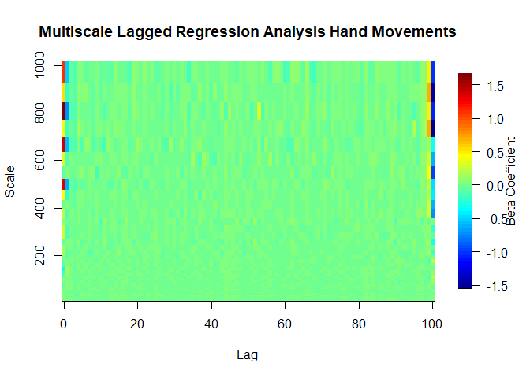

``` r
#contour(x, y, mlra.out,levels=seq(0,1,by=1),add=TRUE,col='black')
```

# References

-   Ihlen, E. A. F. (2012). Introduction to Multifractal Detrended
    Fluctuation Analysis in Matlab. Frontiers in Physiology, 3.
    <https://doi.org/10.3389/fphys.2012.00141>
-   Kantelhardt, J. W., Koscielny-Bunde, E., Rego, H. H. A., Havlin, S.,
    & Bunde, A. (2001). Detecting long-range correlations with detrended
    fluctuation analysis. Physica A: Statistical Mechanics and Its
    Applications, 295(3), 441–454.
    <https://doi.org/10.1016/S0378-4371(01)00144-3>
-   Kantelhardt, J. W., Zschiegner, S. A., Koscielny-Bunde, E., Havlin,
    S., Bunde, A., & Stanley, H. E. (2002). Multifractal detrended
    fluctuation analysis of nonstationary time series. Physica A:
    Statistical Mechanics and Its Applications, 316(1), 87–114.
    <https://doi.org/10.1016/S0378-4371(02)01383-3>
-   Kristoufek, L. (2013). Mixed-correlated ARFIMA processes for
    power-law cross-correlations. Physica A: Statistical Mechanics and
    Its Applications, 392(24), 6484–6493.
    <https://doi.org/10.1016/j.physa.2013.08.041>
-   Peng, C.-K., Buldyrev, S. V., Havlin, S., Simons, M., Stanley, H.
    E., & Goldberger, A. L. (1994). Mosaic organization of DNA
    nucleotides. Physical Review E, 49(2), 1685–1689.
    <https://doi.org/10.1103/PhysRevE.49.1685>
-   Podobnik, B., & Stanley, H. E. (2008). Detrended Cross-Correlation
    Analysis: A New Method for Analyzing Two Nonstationary Time Series.
    Physical Review Letters, 100(8), 084102.
    <https://doi.org/10.1103/PhysRevLett.100.084102>
-   Wallot, S., Mitkidis, P., McGraw, J. J. and Roepstorff, A. (2016).
    Beyond synchrony: joint action in a complex production task reveals
    beneficial effects of decreased interpersonal synchrony. PloS one,
    11(12), e0168306.
