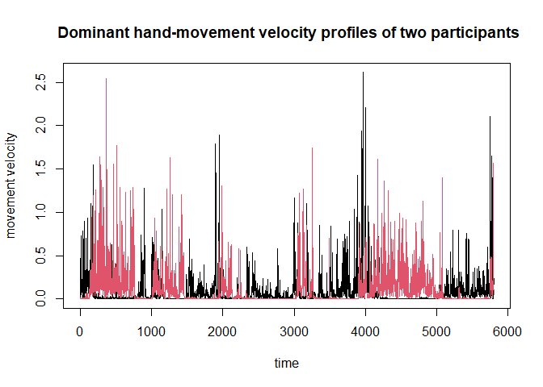
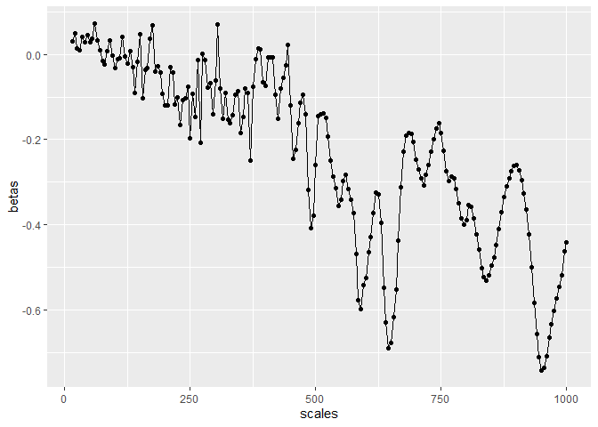

# Summary

Time series data from scientific fields as diverse as astrophysics,
economics, human movement science, and neuroscience all exhibit fractal
properties. That is, these time series often exhibit self-similarity and
long-range correlations. This `fractalRegression` package implements a
number of univariate and bivariate time series tools appropriate for
analyzing noisy data exhibiting these properties. These methods,
especially the bivariate tools (Kristoufek 2015; Likens et al. 2019)
have yet to be implemented in a complete package for the R Statistical
Software environment. As both practitioners and developers of these
methods, we expect these tools will be of interest to a wide audience of
R users, especially those from fields such as the human movement,
cognitive, and other behavioral sciences. The algorithms have been
developed in C++ using the popular Rcpp (Eddelbuettel and Francois 2011)
and RcppArmadillo (Eddelbuettel and Sanderson 2014) packages. The result
is a collection of efficient functions that perform well even on long
time series (e.g., ≥ 10,000 data points).

# Statement of need

Fractal analysis, in its many forms, has become an important framework
in virtually every area of science, often serving as an indicator of
system health (Goldberger et al. 2002), adaptability (Bak, Tang, and
Wiesenfeld 1987), control (Likens et al. 2015), cognitive function
(Euler et al. 2016), and multi-scale interactions (Kelty-Stephen 2017).
In particular, various methods related to Detrended Fluctuation Analysis
(DFA) (Peng et al. 1994) have rose to prominence due to their ease of
understanding and broad applicability to stationary and nonstationary
time series, alike. The basic DFA algorithm has been implemented in
numerous packages and software programs. However, advanced methods such
as Multifractal Detrended Fluctuation Analysis (MFDFA) (Kantelhardt et
al. 2002), Detrended Cross Correlation (DCCA) (Zebende 2011; Podobnik et
al. 2011), and, in particular, fractal regression techniques such as
Multiscale Regression Analysis (MRA) (Kristoufek 2015; Likens et al.
2019) have not yet been implemented in a comprehensive CRAN Package for
the R Statistical Software Environment. Thus, there is a clear need for
a package that incorporates this functionality in order to advance
theoretical research focused on understanding the time varying
properties of natural phenomena and applied research that uses those
insights in important areas such as healthcare (Cavanaugh,
Kelty-Stephen, and Stergiou 2017) and education(Snow et al. 2016).

Some foundational efforts in fractal analyses, which partially overlap
with the functionality of this package, have been implemented elsewhere.
For example, a number of univariate fractal and multifractal analyses
have been implemented in the ‘fracLab’ library for MATLAB (Legrand and
Véhel 2003) and other toolboxes that are mainly targeted at multifractal
analysis (Ihlen and Vereijken 2010; Ihlen et al. 2012). In terms of open
access packages, there are other packages that implement some, but not
all of the same functions such as the `fathon` package (Bianchi 2020)
that has been implemented in Python as well as the R packages: `fractal`
\[@\], `nonlinearTseries` (Garcia 2020), and `MFDFA` (Laib et al. 2018).
However, none of the above packages incorporate monofractal and
multifractal DFA with DCCA and MRA and run on a C++ architecture. Our
`fractalRegression` package is unique in this combination of analyses,
efficiency. For instance, we are not aware of any other packages that
feature MRA and Multiscale Lagged Regression (MLRA).

In this example, we provide a brief demonstration of multiscale
regression analysis using the ‘handmovement’ data provided in the `crqa`
package (Coco and Dale 2014) for R. In the study cited in that package
(Wallot et al. 2016), participants performed a collaborative task
wherein they built model cars while their hand movements were measured
via accelerometers attached to the wrist. Presented below, and also in
the
[vignette](https://github.com/aaronlikens/fractalRegression/tree/master/vignettes)
provided with the package, are the results of applying the `mra`
function to the bivariate time series formed from the movements of the
collaborators dominant hands. We arbitrarily choose person 1 (P1) from
that dataset to serve as the predictor series and person 2 (P2) to serve
as the criterion in the multiscale regression. The two time series are
depicted in .

Visual inspection of these series suggests that the two collaborators
tended to take turns during the experiment, alternating between periods
of inactivity and activity. This is visually evident from the bursts of
red and black lines that almost perfectly alternate in activity level.
One might expect, based on these two series that correlation between the
collaborator’s movements would not be correlated at shorter time scales,
but would become negatively correlated over longer time scales. The
results from Multiscale Regression Analysis (MRA) are given in Figure 2
and support this expectation.

In particular, note that *β*(*s*) are very close to zero at small
scales, but becomes increasingly negative at larger time scales, as
anticipated from visual inspection of the time series. And, one would
expect DCCA to produce similar results (see vignette).

In summary, this `fractalRegression` package collects older univariate
and bivariate techniques into a single, efficient package that can be
installed directly from the CRAN network or github. We anticipate this
software will be of benefit to many across many scientific disciplines.

# Acknowledgements

Author AL receives support from a National Institutes of Health Center
grant (P20GM109090).

# References

Bak, Per, Chao Tang, and Kurt Wiesenfeld. 1987. “Self-Organized
Criticality: An Explanation of the 1/f Noise.” *Physical Review Letters*
59 (4): 381–84. <https://doi.org/10.1103/PhysRevLett.59.381>.

Bianchi, Stefano. 2020. “Fathon: A Python Package for a Fast Computation
of Detrendend Fluctuation Analysis and Related Algorithms.” *Journal of
Open Source Software* 5 (45): 1828.

Cavanaugh, James T., Damian G. Kelty-Stephen, and Nicholas Stergiou.
2017. “Multifractality, Interactivity, and the Adaptive Capacity of the
Human Movement System: A Perspective for Advancing the Conceptual Basis
of Neurologic Physical Therapy.”
<https://www.ingentaconnect.com/content/wk/npt/2017/00000041/00000004/art00007>.

Coco, Moreno I., and Rick Dale. 2014. “Cross-Recurrence Quantification
Analysis of Categorical and Continuous Time Series: An r Package.”
*Frontiers in Psychology* 5: 510.

Eddelbuettel, Dirk, and Romain Francois. 2011. “Rcpp: Seamless R and C++
Integration.” *Journal of Statistical Software* 40 (1): 1–18.
<https://doi.org/10.18637/jss.v040.i08>.

Eddelbuettel, Dirk, and Conrad Sanderson. 2014. “RcppArmadillo:
Accelerating R with High-Performance C++ Linear Algebra.” *Computational
Statistics & Data Analysis* 71 (March): 1054–63.
<https://doi.org/10.1016/j.csda.2013.02.005>.

Euler, Matthew J., Travis J. Wiltshire, Madison A. Niermeyer, and
Jonathan E. Butner. 2016. “Working Memory Performance Inversely Predicts
Spontaneous Delta and Theta-Band Scaling Relations.” *Brain Research*
1637 (April): 22–33. <https://doi.org/10.1016/j.brainres.2016.02.008>.

Garcia, Constantino A. 2020. *nonlinearTseries: Nonlinear Time Series
Analysis*. <https://CRAN.R-project.org/package=nonlinearTseries>.

Goldberger, Ary L., Luis A. N. Amaral, Jeffrey M. Hausdorff, Plamen Ch
Ivanov, C.-K. Peng, and H. Eugene Stanley. 2002. “Fractal Dynamics in
Physiology: Alterations with Disease and Aging.” *Proceedings of the
National Academy of Sciences* 99 (suppl 1): 2466–72.
<https://doi.org/10.1073/pnas.012579499>.

Ihlen, Espen A. F., Olav Sletvold, Tobias Goihl, Per B. Wik, Beatrix
Vereijken, and Jorunn Helbostad. 2012. “Older Adults Have Unstable Gait
Kinematics During Weight Transfer.” *Journal of Biomechanics* 45 (9):
1559–65. <https://doi.org/10.1016/j.jbiomech.2012.04.021>.

Ihlen, Espen A. F., and Beatrix Vereijken. 2010. “Interaction-Dominant
Dynamics in Human Cognition: Beyond 1/? Fluctuation.” *Journal of
Experimental Psychology: General* 139 (3): 436–63.
<https://doi.org/10.1037/a0019098>.

Kantelhardt, Jan W., Stephan A. Zschiegner, Eva Koscielny-Bunde, Shlomo
Havlin, Armin Bunde, and H. Eugene Stanley. 2002. “Multifractal
Detrended Fluctuation Analysis of Nonstationary Time Series.” *Physica
A: Statistical Mechanics and Its Applications* 316 (1): 87–114.
<https://doi.org/10.1016/S0378-4371(02)01383-3>.

Kelty-Stephen, Damian G. 2017. “Threading a Multifractal Social
Psychology Through Within-Organism Coordination to Within-Group
Interactions: A Tale of Coordination in Three Acts.” *Chaos, Solitons &
Fractals* 104 (November): 363–70.
<https://doi.org/10.1016/j.chaos.2017.08.037>.

Kristoufek, Ladislav. 2015. “Detrended Fluctuation Analysis as a
Regression Framework: Estimating Dependence at Different Scales.”
*Physical Review E* 91 (2): 022802.
<https://doi.org/10.1103/PhysRevE.91.022802>.

Laib, Mohamed, Jean Golay, Luciano Telesca, and Mikhail Kanevski. 2018.
“Multifractal Analysis of the Time Series of Daily Means of Wind Speed
in Complex Regions.” *Chaos, Solitons & Fractals* 109 (April): 118–27.
<https://doi.org/10.1016/j.chaos.2018.02.024>.

Legrand, Pierrick, and J. L. Véhel. 2003. “Signal and Image Processing
with FracLab.” *Thinking in Patterns: Fractals and Related Phenomena in
Nature*, 321322.

Likens, Aaron D., Polemnia G. Amazeen, Stephen G. West, and Cameron T.
Gibbons. 2019. “Statistical Properties of Multiscale Regression
Analysis: Simulation and Application to Human Postural Control.”
*Physica A: Statistical Mechanics and Its Applications* 532 (October):
121580. <https://doi.org/10.1016/j.physa.2019.121580>.

Likens, Aaron D., Justin M. Fine, Eric L. Amazeen, and Polemnia G.
Amazeen. 2015. “Experimental Control of Scaling Behavior: What Is Not
Fractal?” *Experimental Brain Research* 233 (10): 2813–21.
<https://doi.org/10.1007/s00221-015-4351-4>.

Peng, C. K., S. V. Buldyrev, S. Havlin, M. Simons, H. E. Stanley, and A.
L. Goldberger. 1994. “Mosaic Organization of DNA Nucleotides.” *Physical
Review E* 49 (2): 1685–89. <https://doi.org/10.1103/PhysRevE.49.1685>.

Podobnik, Boris, Zhi-Qiang Jiang, Wei-Xing Zhou, and H. Eugene Stanley.
2011. “Statistical Tests for Power-Law Cross-Correlated Processes.”
*Physical Review E* 84 (6): 066118.

Snow, Erica L., Aaron D. Likens, Laura K. Allen, and Danielle S.
McNamara. 2016. “Taking Control: Stealth Assessment of Deterministic
Behaviors Within a Game-Based System.” *International Journal of
Artificial Intelligence in Education* 26 (4): 1011–32.
<https://doi.org/10.1007/s40593-015-0085-5>.

Wallot, Sebastian, Panagiotis Mitkidis, John J. McGraw, and Andreas
Roepstorff. 2016. “Beyond Synchrony: Joint Action in a Complex
Production Task Reveals Beneficial Effects of Decreased Interpersonal
Synchrony.” *PloS One* 11 (12): e0168306.

Zebende, G. F. 2011. “DCCA Cross-Correlation Coefficient: Quantifying
Level of Cross-Correlation.” *Physica A: Statistical Mechanics and Its
Applications* 390 (4): 614–18.
<https://doi.org/10.1016/j.physa.2010.10.022>.

[1] Custom footnotes for e.g. denoting who the corresponding author is
can be included like this.
